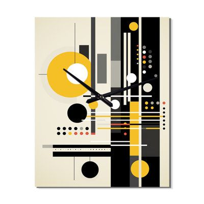
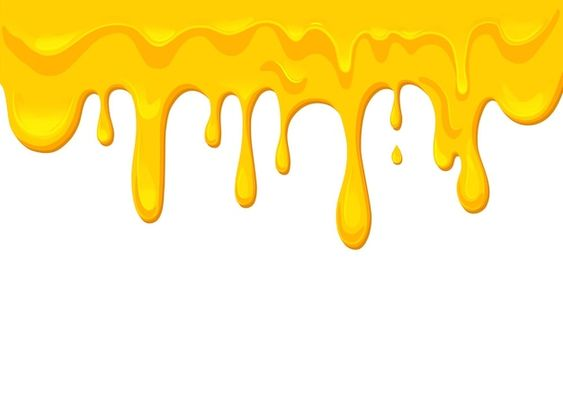
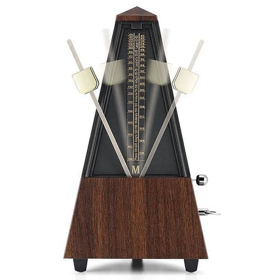

# zshe0442_9103_tut1_group-A
## Major project_Individual Task

### Part 1 : Interacting with the Work
There is a play/pause button at the bottom of the canvas. Clicking the button with the mouse will toggle between playing and pausing the audio ("The Entertainer.mp3"). When the sound is playing, the artwork responds to the audio's frequency, and you can observe how the shapes on the canvas react to the playing sound. You will see circles enlarge, lines sway, and colors dynamically change according to the frequency of the sound.

### Part 2 : Individual Approach to Animating Group Code
- I use the frequency content of the audio track to animate my work.

- When the mouse clicks to play and the music starts, the yellow lines at the top-left corner of the canvas will change in length in response to the audio.  The three red circles will dynamically adjust their size based on the audio frequency, and the cat's eyes will move in sync with the audio.  In the center of the canvas, the yellow dotted rectangle will respond to the frequency of the audio, with the points inside the rectangle expanding or shrinking according to the sound frequency.  Two diagonal lines will swing up and down like a metronome during a percussion practice, moving with the audio.  The orange rectangle at the bottom-right corner will change its RGB color properties according to the audio spectrum.

- The inspiration for these images of my personal animation.

  I referenced these three images as inspiration for my animation. The array of circles in different sizes on the left and right sides of the first image inspired the pulsating dot effect in the group code. The melting cheese effect in the second image reminded me of the yellow lines in the upper left corner of the group code, so I combined the lines with audio, allowing them to change length according to the spectrum. The third image features a metronome, commonly used in percussion practice, which inspired me to make the diagonal lines in the group code swing up and down with the audio.

- I use FFT (Fast Fourier Transform) to analyze the audio spectrum, the Artwork class to manage all the shapes, and the Shape class to define the properties of the shapes (position, size, color, etc.). In the Shape class, I dynamically change the color and position of specific shapes based on the audio spectrum, creating interesting animation effects.